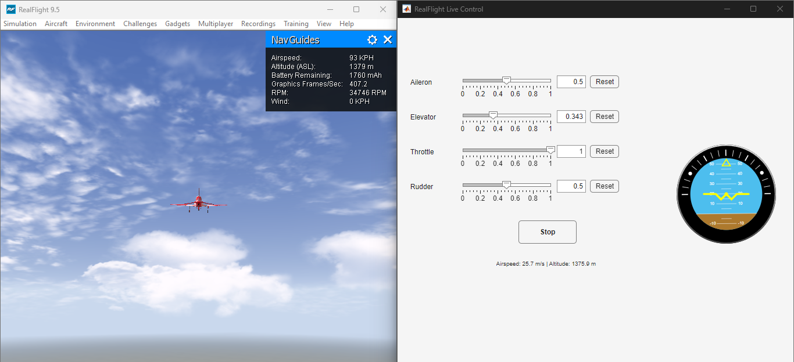

# RealFlight-MATLAB\_Link

A live MATLAB interface to control and monitor **RealFlight RC Simulator** using sliders and a real-time HUD GUI. This project uses the built-in SOAP server in RealFlight to send channel control values (Aileron, Elevator, Throttle, Rudder) and receive live telemetry (pitch, roll, airspeed, altitude).

---

## ✈️ Features

* 🔧 **Live control inputs** via GUI sliders
* 🧭 **Artificial Horizon** (from Aerospace Toolbox)
* 📡 **Real-time telemetry feedback** from the simulator
* 🖱️ **Start/Stop/Reset controls** for user-friendly operation
* 🧪 Includes a standalone test script without GUI

---

## 📂 File Overview

| File                     | Description                                                   |
| ------------------------ | ------------------------------------------------------------- |
| `RealFlightLiveGUI.m`    | Main GUI with live control and HUD                            |
| `RF_Connect_Test.m`      | Standalone script to test RealFlight SOAP control & telemetry |
---

## 🖥️ GUI Preview



---

## ▶️ How to Use

1. Launch RealFlight and load any aircraft. Make sure "FlightAxis Link Enabled" = yes in RealFlight> Simulation>Settings>Physics menu.
2. Open MATLAB and run:

```matlab
RealFlightLiveGUI
```

3. Use sliders to control Ail, Ele, Thr, Rud. Press **Start** to begin live control.
4. Watch artificial horizon and telemetry update in real-time.

---

## 🧪 CLI Mode (No GUI)

To test communication without using the GUI:

```matlab
RF_Connect_Test
```

This script:

* Injects external control
* Sends dynamic throttle ramp
* Prints telemetry to console

---

## 📄 License

This project is licensed under the [MIT License](LICENSE). Feel free to fork, modify, or contribute!
